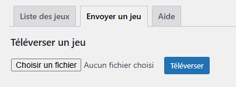

# WordPress Plugin - Emulator

## Description
This plugin allows you to upload retro gaming ROMs and launch an emulator directly from your WordPress site.

> [!NOTE]
> Works with [**EmulatorJS**](https://github.com/EmulatorJS/EmulatorJS)

## Supported ROM Formats

- Super Nintendo (SNES): smc, sfc, fig, swc, bs, st
- Game Boy Advance (GBA): gba
- Game Boy (GB): gb, gbc, dmg
- Nintendo Entertainment System (NES): fds, nes, unif, unf
- Virtual Boy (VB): vb, vboy
- Nintendo DS (NDS): nds
- Nintendo 64 (N64): n64, z64, v64, u1, ndd
- Sega Master System (SMS): sms
- Sega Mega Drive / Genesis (MD): smd, md
- Sega Game Gear (GG): gg
- PlayStation (PSX): pbp, chd

## Features
  - Upload games from the admin interface.
  - Lists available games and provides associated shortcodes for easy embedding in a post or page.

## Installation

1. Download the plugin files.
2. Unzip the archive and upload the folder to `wp-content/plugins`.
3. Activate the plugin from the WordPress admin interface under "Plugins".

## Configuration

After activation, you’ll find a new option in the WordPress admin menu.

# Plugin WordPress - Emulateur

## Description
Ce plugin permet d'uploader des roms de jeux rétrogaming et de lancer un émulateur directement depuis le site WordPress. 

> [!NOTE]
> Fonctionne avec [**EmulatorJS**](https://github.com/EmulatorJS/EmulatorJS)

## Formats de ROMs pris en charge

- Super Nintendo (SNES): smc, sfc, fig, swc, bs, st
- Game Boy Advance (GBA): gba
- Game Boy (GB): gb, gbc, dmg
- Nintendo Entertainment System (NES): fds, nes, unif, unf
- Virtual Boy (VB): vb, vboy
- Nintendo DS (NDS): nds
- Nintendo 64 (N64): n64, z64, v64, u1, ndd
- Sega Master System (SMS): sms
- Sega Mega Drive / Genesis (MD): smd, md
- Sega Game Gear (GG): gg
- PlayStation (PSX): pbp, chd

## Fonctionnalités
  - Téléversement d'un jeu depuis l'administration.
  - Liste les jeux disponibles et le shortcode associé pour une intégration facile dans un article ou une page.

## Installation

1. Téléchargez les fichiers du plugin.
2. Décompressez l'archive et téléversez le dossier dans `wp-content/plugins`.
3. Activez le plugin depuis l'interface d'administration de WordPress, sous "Extensions".

## Configuration

Après l'activation, vous trouverez une nouvelle option dans le menu d'administration de WordPress.

